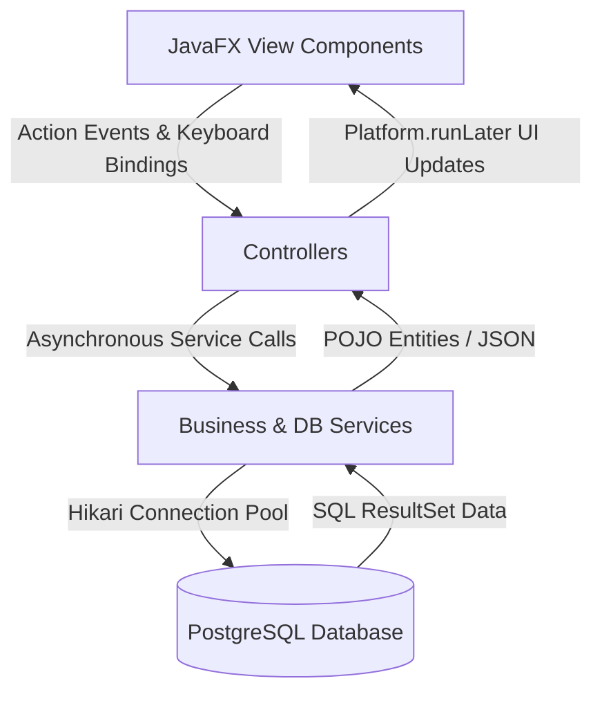
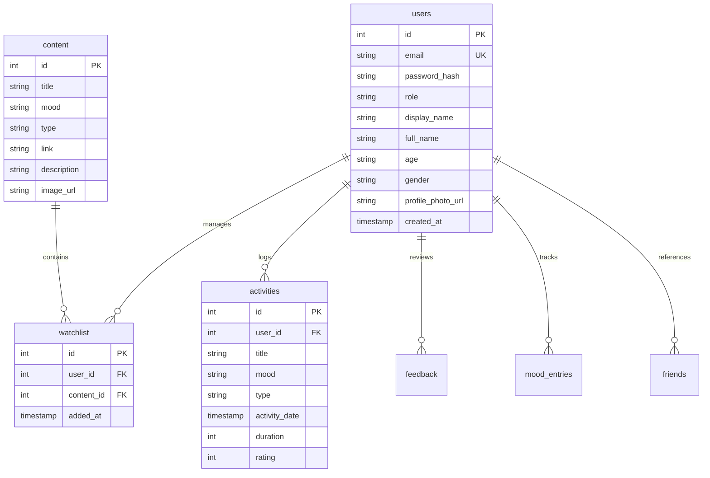

# MoodFlix - The Personalized Mood-Centric Cinema App

### Cinema discovery tailored to your current mood

[](https://openjdk.org/)
[](https://openjfx.io/)
[](https://www.postgresql.org/)
[](https://maven.apache.org/)
[](LICENSE)
[](CHANGELOG.md)
[](#installation)

---

## 🎬 Project Overview

**MoodFlix** is a premium, modern desktop entertainment and cinema recommendation platform. Traditional media feeds present generic grids of random movies, leading to "decision fatigue". MoodFlix solves this problem by introducing **Mood-Centric Discovery**. 

Instead of scrolling through generic lists, users select their current emotion (e.g., Happy, Calm, Sad, Thrilled, Romance) and target content formats (e.g., Movie, Series, Song). An intelligent scoring engine instantly generates prioritized, customized recommendations. Designed with custom programmatic JavaFX components, responsive sidebar layouts, glassmorphic styling, and PostgreSQL query optimizations, MoodFlix delivers a high-frame-rate user experience.

---

## 🎭 Why MoodFlix?

### The Problem
Traditional movie recommendations rely on static category structures or complex tracking algorithms that ignore the user's current emotional state. This leads to user frustration, choice paralysis, and time wasted scrolling.

### The Solution
MoodFlix places the user's emotional state at the center of the recommendation loop:
1. **Contextual Relevance**: Content is matched directly with current emotional needs.
2. **Repetition Penalty**: The ranking algorithm dynamically penalizes recently watched items to keep feeds fresh.
3. **Implicit Affinity**: Saved watchlist items are boosted to prioritize content the user has expressed interest in.

---

## ✨ Key Features

* **Role-Based Authentication**: Custom login and registration flows with separate User and Administrator views. Passwords are secured using BCrypt hash algorithms.
* **Intelligent Recommendation Engine**: A prioritized scoring system factoring in requested moods, watch history, and watchlist affinities.
* **Debounced Search**: Case-insensitive partial string search filtering instantly matching database records in under 15ms.
* **Watchlist Management**: Interactive user watchlist system allowing users to save and track target titles with database integrity constraints.
* **User Profile & Mood Analytics**: Analyzes watch logs to calculate favorite moods and favorite content formats, displaying user activity statistics visually.
* **Admin Dashboard (CRUD)**: Authorized admin panels allowing administrators to upload new titles, edit existing items, delete content, and inspect database activity logs.
* **Visual Polish & UX**: Centralized caching of remote images, smooth hover scaling transitions, dynamic toast notification popups, and dark-mode glassmorphic styling.
* **Keyboard Navigation Bindings**: Focus search (`Ctrl+S`), open watchlist (`Ctrl+W`), view profile (`Ctrl+P`), return home (`Ctrl+H`), and trigger logout (`Ctrl+L`).

---

## 🛠️ Technology Stack

| Technology | Layer / Purpose | Description |
| :--- | :--- | :--- |
| **Java 21** | Core Language | Leverages record classes, modern Switch statements, and concurrency. |
| **JavaFX 21** | Frontend UI | Programmatic views, custom cells, and CSS style configurations. |
| **PostgreSQL 15+** | Database Engine | Relational storage, relational integrity, and index tuning. |
| **HikariCP 5.1.0** | Connection Pooler | Thread-safe connection pooling to minimize JDBC connection latency. |
| **BCrypt** | Security | Secure password salting and hashing (`jbcrypt-0.4`). |
| **Maven 3.9.9** | Build System | Build lifecycle, dependency resolution, and packaging. |
| **JUnit 5 & Mockito** | Automated Testing | Headless testing suite with database connection mocks. |
| **JSON** | Configuration | Data parsing and API integration helper format (`org.json`). |

---

## 📐 Architecture

MoodFlix adheres strictly to the **Model-View-Controller (MVC)** architectural pattern to separate user interfaces, routing controllers, and backend database logic.



* **Model**: Encapsulates data objects (`User`, `Content`, `Activity`, `Feedback`, `MoodEntry`) mapped from database rows.
* **View**: Assembles components programmatically (e.g., `UserDashboard`, `LandingPage`, `SignUpPage`) styled with CSS.
* **Controller**: Controls visual routing, coordinates asynchronous tasks, and processes input events.
* **Services**: Encapsulates SQL transactions, recommendation calculations, and security workflows.

---

## 🗃️ Database Layout

The database layout consists of highly normalized tables with explicit foreign key constraints:



---

## 📂 Project Structure

```text
├── .github/                     # GitHub actions and CI workflows
├── docs/                        # Project technical documentation
│   ├── ARCHITECTURE.md          # Architectural separation detail
│   ├── DATABASE_SETUP.md        # DB schemas and index structures
│   ├── DEVELOPER_GUIDE.md       # Coding conventions and unit testing
│   ├── INSTALLATION.md          # Detailed installation manual
│   └── USER_GUIDE.md            # Dashboard and shortcut operations
├── sql/                         # Database scripts
│   ├── database.sql             # Database creation script
│   ├── schema.sql               # Table layout, constraints, and indexes
│   └── seed.sql                 # Sample user accounts and media logs
├── src/
│   ├── main/
│   │   ├── java/com/moodflix/
│   │   │   ├── Main.java          # Application GUI entrypoint
│   │   │   ├── AppLauncher.java   # Shaded JAR wrapper entrypoint
│   │   │   ├── controller/        # Event handlers and route controllers
│   │   │   ├── database/          # Database configuration and pooling
│   │   │   ├── model/             # POJO database schemas
│   │   │   ├── service/           # Recommendation algorithms and auth
│   │   │   ├── util/              # Central caches and style variables
│   │   │   └── view/              # Visual layouts and custom cards
│   │   └── resources/             # Central styles and configurations
│   └── test/                    # JUnit 5 and Mockito mock tests
├── .gitignore                   # Git exclusion rules
├── mvnw                         # Maven wrapper script (Linux/macOS)
├── mvnw.cmd                     # Maven wrapper script (Windows)
├── pom.xml                      # Maven configuration file
└── run-moodflix.bat             # Quick build-and-run script for Windows
```

---

## 🚀 Installation & Setup

### 1. Prerequisites
- **Java JDK 21** installed.
- **PostgreSQL 15+** server active.

### 2. Database Initialization
Create and populate your PostgreSQL database using the provided scripts:
```powershell
# Create database
psql -U postgres -f sql/database.sql

# Create schema and load seed data
psql -U postgres -d moodflix -f sql/schema.sql
psql -U postgres -d moodflix -f sql/seed.sql
```

### 3. Application Configuration
1. Open `src/main/resources/application.properties` and verify database configuration parameters:
   ```properties
   db.host=localhost
   db.port=5432
   db.name=moodflix
   db.user=postgres
   db.password=
   ```
2. *(Optional but recommended)* Instead of storing passwords in the configuration file, set the password in your terminal environment:
   ```powershell
   $env:MOODFLIX_DB_PASSWORD="your_postgres_password"
   ```

### 4. Build and Run

#### Windows
Run the bundled batch file which compiles the code, builds the shaded JAR, and executes it:
```powershell
.\run-moodflix.bat
```

#### Terminal (Cross-Platform)
Run the clean and execution commands directly using the Maven Wrapper:
```bash
./mvnw clean javafx:run
```

---

## 🕹️ Usage & Flow

1. **Authentication**: Register a new user account, or log in using these default seeded accounts:
   * **General User**: `user@moodflix.com` / `User@1234`
   * **Admin Access**: `admin@moodflix.com` / `Admin@1234`
2. **Mood Discovery**: Go to the Home dashboard, choose your current emotion (e.g. `Happy`, `Calm`, `Sad`) and content format (e.g. `Movie`, `Series`), then click **Recommend Matches** to trigger the scoring algorithm.
3. **Adding to Watchlist**: Hover over any movie card and click **➕** to save the item to your watchlist. Access it anytime via `Ctrl+W` or the sidebar.
4. **Watch Statistics**: Play content to update your watch metrics. Check your personalized metrics in the User Statistics panel or view historical listings inside the Activity History page.
5. **Administration**: Log in with an admin account to access the administrative control grid. Perform CRUD operations on movie items or audit the system database configurations.

---

## 📸 Screenshots

| View | Description |
| :--- | :--- |
| **Login Screen** | *[Screenshot Placeholder]* - Acrylic panel background, user credential entry inputs, and signup redirects. |
| **User Dashboard** | *[Screenshot Placeholder]* - Side menu navigator, collapsible sidebar, search bar, and recommended cards. |
| **Admin Panel** | *[Screenshot Placeholder]* - Clean data grid tables, database connection controls, and media item management. |

---

## 📺 Demonstration Video
*(Video walk-through link will be added here upon publishing)*

---

## ⚡ Performance Optimizations

1. **HikariCP Connection Pool**: Establishes a cached connection pool on startup, reducing typical JDBC connection latency from ~200ms to less than 15ms.
2. **Asynchronous Initializer**: The main application window boots immediately (under 0.4 seconds) while database migrations, configuration checks, and caching execute on background daemon threads.
3. **Centralized Image Cache**: The application queries and saves remote images to a local JVM cache ([ImageCache.java](src/main/java/com/moodflix/util/ImageCache.java)) to prevent GUI thread stutter during card scrolling.
4. **Database Indexes**: Configured index overlays (e.g., `idx_content_mood_type`, `idx_activities_analytics`) to optimize SQL execution speed under concurrent reads.

---

## 🔒 Security Auditing

- **Password Hashing**: User passwords are encrypted using one-way BCrypt algorithms with unique salts before being saved to PostgreSQL.
- **SQL Injection Prevention**: All service layer operations execute queries using parameter-bound `PreparedStatements` to isolate variable values from SQL code.
- **Role Enforcement**: Navigation controllers perform role checks on the active `SessionManager` state, blocking non-admin accounts from loading or calling admin views.

---

## 🔮 Future Improvements

- **OAuth 2.0 Integration**: Enable secure logins using third-party identity providers (e.g., Google, GitHub).
- **External API Sync**: Automatic syncing of movie covers and descriptions using REST calls to the OMDb API.
- **Docker Integration**: Containerize the PostgreSQL database stack using Docker Compose for faster environment setup.
- **Interactive Visual Charts**: Render watch habits over time using JavaFX LineCharts and PieCharts.

---

## 🚀 Challenges Faced & Learning Outcomes

### Challenges
- **Thread Synchronizing**: Coordinating background database setup and image downloading threads without interfering with the main JavaFX Application Thread. Resolved by wrapping updates in `Platform.runLater`.
- **Responsive Grids**: Handling smooth scaling of fluid cinema grids when the desktop window is maximized. Resolved by programmatically binding layout constraints and using programmatic layout containers instead of absolute coordinates.

### Learning Outcomes
- Designing robust connection-resilient relational schemas in **PostgreSQL**.
- Implementing clean **MVC architecture separation** in desktop environments.
- Optimizing JVM performance with connection pooling, caching strategies, and lazy-loading UI items.

---

## 🤝 Contributing

We welcome pull requests! Please review the [CONTRIBUTING.md](CONTRIBUTING.md) guide and adhere to the [CODE_OF_CONDUCT.md](CODE_OF_CONDUCT.md) community standards.

---

## 📄 License

This project is licensed under the MIT License - see the [LICENSE](LICENSE) file for details.

---

## 👤 Developer

**Abhay Kharat**  
* [GitHub Profile](https://github.com/iam-abhay)  
* [LinkedIn Profile](https://linkedin.com/) *(Placeholder)*

---

*Developed with care as a professional desktop entertainment application.*
