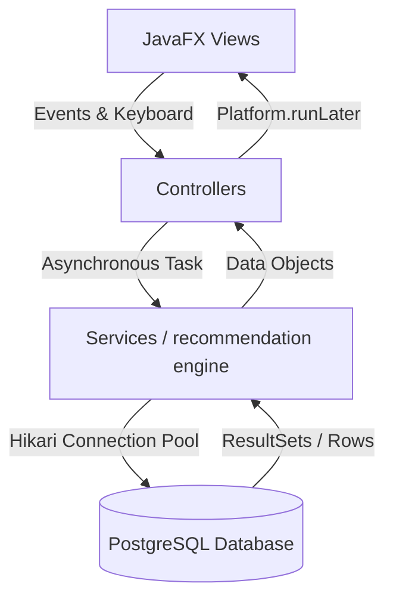

# MoodFlix - The Personalized Mood-Centric Cinema App

[](https://openjdk.org/)
[](https://maven.apache.org/)
[](https://www.postgresql.org/)
[](https://openjfx.io/)
[](LICENSE)
[](#installation)
[](CHANGELOG.md)

---

## 🎬 Project Overview

MoodFlix is a premium, modern desktop entertainment and cinema recommendation platform. Inspired by the visual elegance of Netflix and Spotify, MoodFlix breaks standard generic content feeds by introducing **Mood-Centric Discovery**. Instead of scrolling through infinite lists of random movies, users select their current emotion (e.g., Happy, Calm, Sad, Thrilled, Romance) and context parameters, and our smart ranking engine serves customized, prioritized suggestions.

Designed with JavaFX programmatic components, glassmorphism, responsive sidebar navigations, and optimized PostgreSQL aggregations, MoodFlix is built from the ground up to guarantee a fluid, high-frame-rate user experience.

---

## 🌟 Key Features

1. **Authentication Flow**: Safe login and registration system with user/admin role categorization. Passwords are encrypted using BCrypt hash algorithms.
2. **Intelligent Recommendation Engine**: Scored suggestion algorithms that factor in requested moods, content type, watchlist affinity, and user watch logs to suppress recently viewed items.
3. **Interactive Search**: Debounced, case-insensitive partial string search filtering instantly matching database contents under 15ms.
4. **Watchlist & Favorites Management**: Save and track contents with duplicate insertion prevention.
5. **Admin Management Control Panel**: CRUD panel allowing administrators to delete/edit entries, upload new movies, and inspect active logs.
6. **Activity History & Mood Analytics**: Visually represents watch habits, duration, and favorite emotions in structured card grids.
7. **User Profile Settings**: Customizable profiles with profile photo cache references and local theme overrides.
8. **Keyboard Accessibility**: Fast navigation bindings (`Ctrl+S` to search, `Ctrl+W` to open watchlist, etc.).

---

## 🛠️ Tech Stack

- **Frontend Toolkit**: JavaFX 21 (programmatic layouts, custom cells, and CSS enhancements)
- **Database Engine**: PostgreSQL 15+
- **Connection Pooler**: HikariCP (Connection pooling and leak detection)
- **Security Hashing**: BCrypt (`jbcrypt-0.4`)
- **JSON Parser**: `org.json`
- **Build System**: Apache Maven 3.9.9
- **Coverage Logger**: Jacoco Maven Plugin

---

## 📐 Application Architecture

### MVC Architecture
MoodFlix follows the Model-View-Controller pattern to ensure strict logic separation:
- **Model**: Content, User, Activity, and Feedback schemas encapsulate business data.
- **View**: Programmatic JavaFX view nodes, styled layouts, and responsive elements.
- **Controller**: Debounces search parameters, dispatches threads, and manages click triggers.



---

## 🚀 Installation & Setup

For step-by-step instructions, please read [INSTALLATION.md](docs/INSTALLATION.md).

### Quick Start
1. **Prerequisites**: Ensure you have JDK 21 and PostgreSQL installed.
2. **Database Schema**: Execute [sql/schema.sql](sql/schema.sql) and [sql/seed.sql](sql/seed.sql) on your PostgreSQL server.
3. **Configure Environment Variables**: Set `MOODFLIX_DB_PASSWORD` or edit `db.password` in [application.properties](file:///c:/College+Study/Projects/MoodFlix/Final_MoodFlix/src/main/resources/application.properties).
4. **Execution**:
   * **Option A (Batch script)**: Double-click [run-moodflix.bat](file:///c:/College+Study/Projects/MoodFlix/Final_MoodFlix/run-moodflix.bat) (builds and launches the portable shaded JAR automatically).
   * **Option B (Maven command)**: Run `.\tools\apache-maven-3.9.9\bin\mvn clean javafx:run` in your terminal.


---

## 📂 Project Structure

```text
├── .github/                 # GitHub CI/CD templates and workflows
├── docs/                    # Architectural and setup documentation
│   ├── ARCHITECTURE.md
│   ├── DATABASE_SETUP.md
│   └── INSTALLATION.md
├── sql/                     # PostgreSQL database scripts
│   ├── database.sql
│   ├── schema.sql
│   └── seed.sql
├── src/
│   ├── main/
│   │   ├── java/com/moodflix/
│   │   │   ├── Main.java      # Application bootstrap class
│   │   │   ├── AppLauncher.java# Shade jar wrapper bootstrap class
│   │   │   ├── controller/   # View controllers (MVC Controller)
│   │   │   ├── database/     # Database pooling and configuration
│   │   │   ├── model/        # Application POJO schemas (MVC Model)
│   │   │   ├── service/      # Business logic and database access services
│   │   │   └── view/         # JavaFX layout nodes (MVC View)
│   │   └── resources/        # Application styling and properties
│   └── test/                # Unit test suites using Mockito and JUnit 5
```

---

## 🗃️ Database Layout

The PostgreSQL schema consists of tables with structured foreign key constraints:
- **`users`**: User records, passwords, roles, display name, and profiles.
- **`content`**: Cinema database (title, mood, type, description, video link).
- **`activities`**: Watch history logs (duration, mood, rating, timestamp).
- **`watchlist`**: Junction table preserving user favorite saves.

For details, see [DATABASE_SETUP.md](docs/DATABASE_SETUP.md).

---

## 📸 Screenshots & Demo

### Application Interface
*(Screenshots will be uploaded here upon project release)*
* **Landing Screen**: Slick glassmorphic dashboard showcasing mood classification triggers.
* **Intelligent Discovery Panel**: Dynamically populated cinema cards showing real-time ranking scores.
* **Admin Control Center**: Visual interface managing cinema records and database logs.

### Video Demonstration
*(A brief walk-through video/GIF will be added here upon publishing)*

---

## ⚡ Performance Features

- **Centralized Image Caching**: [ImageCache.java](src/main/java/com/moodflix/util/ImageCache.java) performs thread-safe checks and background image fetching to avoid JavaFX application thread stutter.
- **Asynchronous Startup**: Main app launcher boots JavaFX immediately in under 0.4s while database initialization runs asynchronously.
- **SQL Indexes**: Added composite index constraints on `content(mood, type)` and grouping indexes on `activities(user_id, mood, type)` to optimize search speeds.

---

## 🔮 Future Enhancements

- **OAuth 2.0 Integration**: Enable secure third-party login via Google/GitHub profiles.
- **API Metadata Sync**: Automatic syncing of content covers and movie details via external APIs.
- **Containerized Database**: Docker Compose integration to spin up the database stack with a single command.
- **Rich Interactive Analytics**: Advanced JavaFX visual charts representing mood trends over time.

---

## 🤝 Contributing

We welcome pull requests! For contribution guidelines, please refer to [CONTRIBUTING.md](CONTRIBUTING.md).

---

## 📄 License

This project is licensed under the MIT License - see the [LICENSE](LICENSE) file for details.

---

## 👤 Developer

Developed and maintained by **Abhay Kharat** - [GitHub Profile](https://github.com/abhaykharat-bit).

