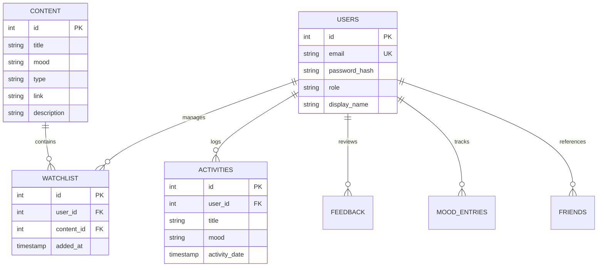

# Database Schema Design & Tuning

MoodFlix uses PostgreSQL to store user profiles, watchlist links, activity logs, and movie metadata.

## Table Structure & Relationships

---

## SQL Performance Indexes

Aggregated views (such as user analytics) and real-time partial lookups are optimized using the following indices:

1. **`idx_content_mood_type`**: Evaluates `mood` and `type` queries together, speeding up recommendation searches.
2. **`idx_content_title`**: Optimizes content name checks and duplicate watchlist validation queries.
3. **`idx_activities_analytics`**: Speeds up statistics aggregation queries.
4. **`idx_users_email`**: Accelerates credential lookups during authentication.
